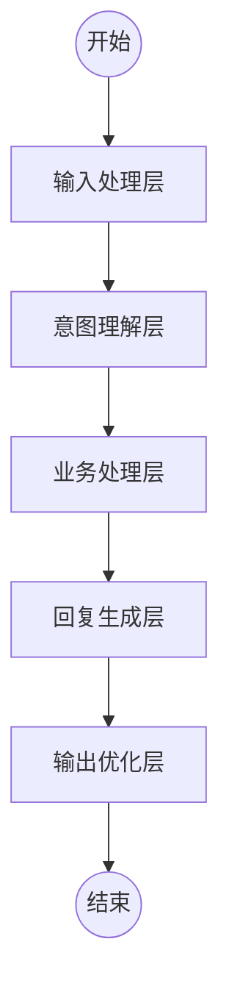
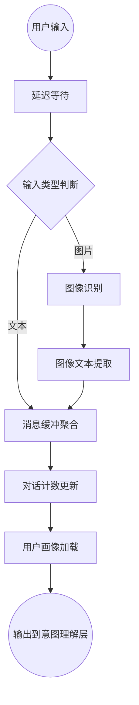
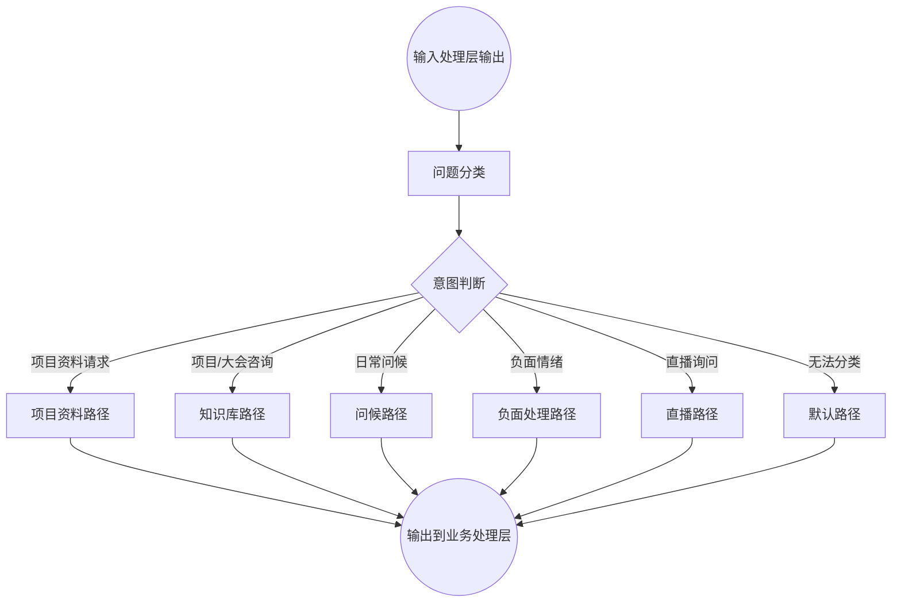
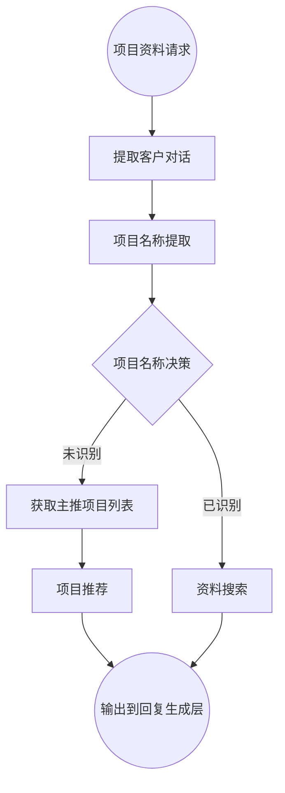

# FastGPT销售智能体V4.0工作流设计文档

## 1. 整体工作流架构

FastGPT工作流将采用模块化设计，通过多个功能节点的组合实现销售智能体V4.0的全部功能需求。整体架构分为输入处理层、意图理解层、业务处理层、回复生成层和输出优化层。



## 2. 工作流详细设计

### 2.1 输入处理层



#### 节点配置详情：

1. **延迟等待**
   - 类型：延迟节点
   - 参数：延迟时间 = 1000ms

2. **输入类型判断**
   - 类型：条件判断节点
   - 条件：检测输入是否包含图片

3. **图像识别**
   - 类型：AI节点(Vision)
   - 模型：多模态模型
   - 系统提示词：
     ```
     你是一个图像描述专家，请详细描述图片内容，特别关注以下内容：
     1. 图片中的文字内容
     2. 图片是否包含项目相关材料
     3. 图片是否包含表格、图表或数据
     4. 图片的主题和核心内容
     输出格式应为JSON：
     {
       "text_content": "图片中的文字内容",
       "is_project_material": true/false,
       "has_data_elements": true/false,
       "main_theme": "主题描述"
     }
     ```

4. **消息缓冲聚合**
   - 类型：代码节点
   - 代码语言：JavaScript
   - 代码内容：
     ```javascript
     function main({messages, timeWindow}) {
       // 获取最近timeWindow时间内的消息
       const recentMessages = messages.filter(msg => 
         (Date.now() - msg.timestamp) <= timeWindow
       );
       
       // 聚合消息内容
       const aggregatedContent = recentMessages.map(msg => msg.content).join('\n');
       
       return {
         aggregatedContent: aggregatedContent,
         messageCount: recentMessages.length
       };
     }
     ```
   - 参数配置：
     - timeWindow: 8000 (8秒)

5. **对话计数更新**
   - 类型：变量更新节点
   - 更新变量：dialogueCount
   - 更新内容：dialogueCount + 1

6. **用户画像加载**
   - 类型：HTTP请求节点
   - 请求方式：GET
   - 请求URL：`${API_BASE_URL}/users/${userId}/profile`
   - 返回数据处理：userProfile变量

### 2.2 意图理解层



#### 节点配置详情：

1. **问题分类**
   - 类型：AI节点(分类)
   - 模型：gpt-4o-mini
   - 系统提示词：
     ```
     你是一个问题分类专家，请将用户输入分为以下几类：
     1. 项目资料请求：当用户明确要求提供项目资料、PPT、介绍文档等
     2. 项目/大会咨询：关于项目详情、大会内容、行业信息的问题
     3. 日常问候：简单的问候语、闲聊内容，不涉及具体业务
     4. 负面情绪：表达不满、拒绝、厌烦或包含负面情绪的消息
     5. 直播询问：关于直播时间、内容、链接的问题
     6. 无法分类：不属于以上类别的问题
     
     请考虑用户消息上下文和可能的图片内容。输出应为一个分类ID：
     - material_request
     - project_inquiry
     - greeting
     - negative_emotion
     - livestream_inquiry
     - unknown
     ```
   - 输入变量：
     - 用户消息：用户输入内容
     - 图片内容：图像识别结果
     - 历史对话：最近10轮对话

2. **意图判断**
   - 类型：条件判断节点
   - 条件：基于问题分类结果路由到不同处理路径

### 2.3 业务处理层

#### 2.3.1 项目资料路径



#### 节点配置详情：

1. **提取客户对话**
   - 类型：代码节点
   - 代码内容：
     ```javascript
     function main({chatHistory}) {
       // 提取最近的用户对话
       const userMessages = chatHistory
         .filter(msg => msg.role === 'user')
         .map(msg => msg.content);
       
       return {
         userDialogues: userMessages
       };
     }
     ```

2. **项目名称提取**
   - 类型：AI节点(内容提取)
   - 模型：gpt-4o-mini
   - 系统提示词：
     ```
     分析用户对话内容，提取用户可能感兴趣的项目名称。考虑以下因素：
     1. 用户明确提到的项目名称
     2. 用户描述但未明确命名的项目特征
     3. 根据上下文推断用户可能感兴趣的项目
     
     返回结果格式：
     {
       "project_name": "提取的项目名称",
       "confidence": 0.85, // 置信度0-1
       "alternative_names": ["备选项目1", "备选项目2"]
     }
     
     如果无法提取，project_name设为null，confidence设为0。
     ```

3. **项目名称决策**
   - 类型：条件判断节点
   - 条件：project_name != null && confidence > 0.6

4. **资料搜索**
   - 类型：知识库节点
   - 知识库ID：项目资料库
   - 检索模式：向量 + 全文
   - 相似度阈值：0.7
   - 过滤条件：`metadata.type == "project_material" && metadata.project_name == "${project_name}"`

5. **获取主推项目列表**
   - 类型：HTTP请求节点
   - 请求方式：GET
   - 请求URL：`${API_BASE_URL}/projects/recommended`

6. **项目推荐**
   - 类型：AI节点(生成)
   - 模型：Doubao-1.5-pro-32k
   - 系统提示词：
     ```
     你是一个项目推荐专家。用户正在寻找项目资料，但未明确指定项目名称。
     请基于用户画像和主推项目列表，推荐最适合的1-2个项目，并简要介绍。
     
     注意：
     1. 推荐时考虑用户画像中的偏好和兴趣
     2. 优先推荐主推项目列表中优先级高的项目
     3. 语气友好自然，避免过于销售化
     4. 适当使用表情，增加亲切感
     ``` 