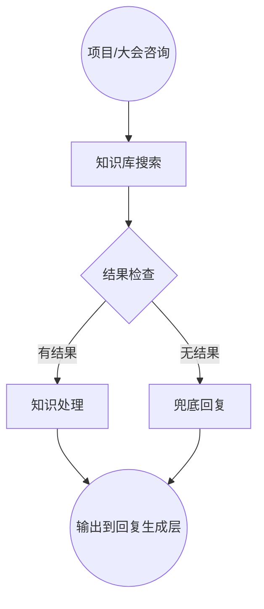
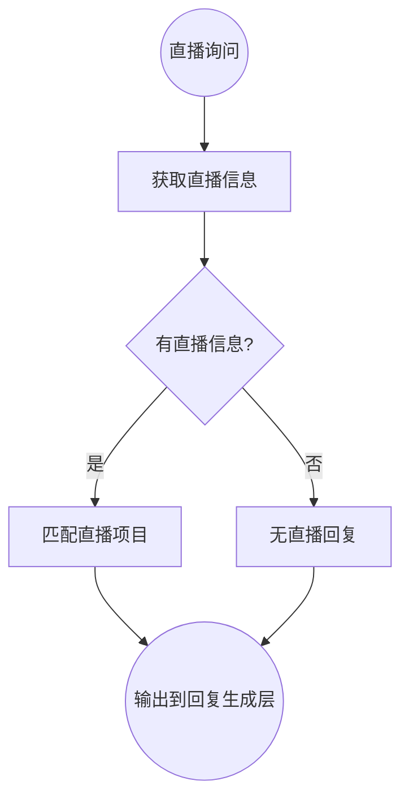
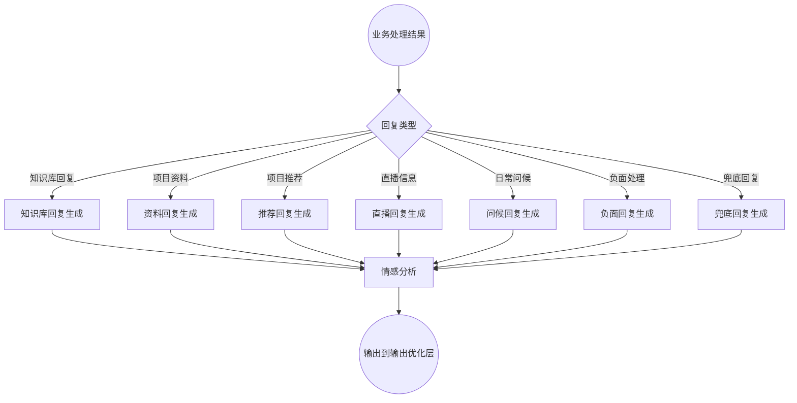
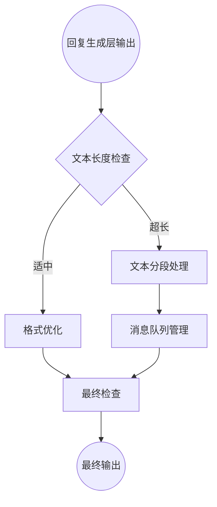

#### 2.3.2 知识库路径



#### 节点配置详情：

1. **知识库搜索**
   - 类型：知识库节点
   - 知识库ID：综合知识库
   - 检索模式：向量检索
   - 相似度阈值：0.55
   - 返回数量：5

2. **结果检查**
   - 类型：条件判断节点
   - 条件：知识库搜索结果长度 > 0

3. **知识处理**
   - 类型：AI节点(知识整合)
   - 模型：gpt-4o-mini
   - 系统提示词：
     ```
     将检索到的知识片段整合成连贯的信息，确保：
     1. 去除重复信息
     2. 按逻辑顺序组织内容
     3. 保留关键细节和数据
     4. 移除不相关内容
     ```

4. **兜底回复**
   - 类型：AI节点(生成)
   - 模型：Doubao-1.5-pro-32k
   - 系统提示词：
     ```
     用户询问的问题无法从知识库中找到明确答案。请生成一个友好的兜底回复，内容包括：
     1. 委婉表示暂时无法提供具体信息
     2. 提供可能的解决方案或替代建议
     3. 询问是否有其他可帮助的事项
     
     回复应当真诚、专业，避免简单地说"不知道"或"没有相关信息"。
     ```

#### 2.3.3 直播路径



#### 节点配置详情：

1. **获取直播信息**
   - 类型：HTTP请求节点
   - 请求方式：GET
   - 请求URL：`${API_BASE_URL}/livestreams/active`

2. **匹配直播项目**
   - 类型：AI节点(分析)
   - 模型：gpt-4o-mini
   - 系统提示词：
     ```
     分析用户问题，从活跃直播列表中匹配最相关的直播信息。考虑：
     1. 用户明确提到的直播名称或项目
     2. 用户感兴趣的主题与直播内容的匹配度
     3. 直播时间的适配性（即将开始的优先级高）
     
     返回格式：
     {
       "matched_livestream": {
         "id": "直播ID",
         "title": "直播标题",
         "time": "直播时间",
         "link": "直播链接"
       },
       "reason": "匹配原因简述"
     }
     ```

3. **无直播回复**
   - 类型：模板节点
   - 模板内容：
     ```
     目前没有计划中的直播活动。我可以为您提供一些项目的详细资料，或者您有其他感兴趣的话题吗？
     ```

### 2.4 回复生成层



#### 节点配置详情：

1. **回复类型**
   - 类型：条件判断节点
   - 条件：基于业务处理层的输出类型确定回复生成策略

2. **知识库回复生成**
   - 类型：AI节点(生成)
   - 模型：Doubao-1.5-pro-32k
   - 系统提示词：
     ```
     基于知识库搜索结果，生成专业、易懂的回答。要求：
     1. 用口语化表达方式
     2. 回答控制在100字左右
     3. 避免使用"根据知识库"等引用提示
     4. 将"投资"改为"合作"
     5. 自然引入用户画像中的个性化元素
     6. 所有项目描述为"我们加速孵化的项目"
     ```

3. **资料回复生成**
   - 类型：AI节点(生成)
   - 模型：Doubao-1.5-pro-32k
   - 系统提示词：
     ```
     用户请求项目资料，已找到相关项目资料。生成回复时：
     1. 简要介绍即将发送的资料内容
     2. 提及这是"我们加速孵化的项目"
     3. 询问用户查看后的感受
     4. 适当使用emoji增加亲切感
     ```

4. **情感分析**
   - 类型：AI节点(分析)
   - 模型：gpt-4o-mini
   - 系统提示词：
     ```
     分析回复内容的情感基调，选择2-3个适合的emoji表情。原则：
     1. 积极内容配合笑脸、点赞等正面表情
     2. 专业内容适当使用专业相关表情
     3. 负面情绪处理使用礼貌、平和的表情
     4. 表情应自然融入文本，不要过度使用
     5. 考虑用户画像中的沟通风格偏好
     
     返回格式：
     {
       "tone": "正面/中性/负面",
       "emojis": ["😊", "👍"],
       "enhanced_text": "添加表情后的文本"
     }
     ```

### 2.5 输出优化层



#### 节点配置详情：

1. **文本长度检查**
   - 类型：条件判断节点
   - 条件：回复文本长度 > 250

2. **文本分段处理**
   - 类型：代码节点
   - 代码内容：
     ```javascript
     function main({responseText}) {
       // 检查文本长度是否超过250
       const textLength = responseText ? responseText.length : 0;
       const isLongText = textLength > 250 ? 1 : 0;
       
       return {
         isLongText: isLongText,
         textLength: textLength
       };
     }
     ```
   - 参数配置：
     - responseText: 回复文本

3. **消息队列管理**
   - 类型：代码节点
   - 代码内容：
     ```javascript
     function main({segments}) {
       return {
         messageQueue: segments.map((segment, index) => ({
           content: segment,
           delay: index * 2000 // 每段消息间隔2秒
         }))
       };
     }
     ```

4. **格式优化**
   - 类型：AI节点(优化)
   - 模型：gpt-4o-mini
   - 系统提示词：
     ```
     优化回复文本的格式，确保：
     1. 段落间有适当空行
     2. 列表项格式一致
     3. 突出重要信息
     4. 表情符号位置自然
     5. 去除多余空格和标点
     
     保持原文意思不变，只调整格式。
     ```

5. **最终检查**
   - 类型：AI节点(审查)
   - 模型：gpt-4o-mini
   - 系统提示词：
     ```
     检查最终回复内容，确保：
     1. 没有出现"根据知识库"等引用提示
     2. 没有出现"我们的项目"（应为"我们加速孵化的项目"）
     3. "投资"已替换为"合作"
     4. 没有出现"您还有其他问题吗？"等客服话术
     5. 没有提及"加微信"或"发邮箱"等敏感词
     6. "你"已替换为"您"
     7. 表情使用自然，数量适中
     
     如发现问题，进行修正；否则原文返回。
     ```

## 3. 变量设计

### 3.1 全局变量

| 变量名 | 类型 | 描述 | 初始值 |
|-------|------|------|-------|
| dialogueCount | number | 对话轮数计数 | 0 |
| userProfile | object | 用户画像数据 | {} |
| confirmAgain | string | 确认标记 | "0" |
| histories | array | 历史消息记录 | [] |
| projectName | string | 识别的项目名称 | "" |
| role | string | 智能体角色设定 | "销售顾问" |

### 3.2 临时变量

| 变量名 | 类型 | 描述 |
|-------|------|------|
| imageContent | object | 图像识别结果 |
| aggregatedMessages | string | 聚合后的消息内容 |
| intentType | string | 识别的意图类型 |
| kbResults | array | 知识库检索结果 |
| projectMaterials | array | 项目资料列表 |
| recommendedProjects | array | 推荐项目列表 |
| liveStreamInfo | object | 直播信息 |
| responseSegments | array | 分段后的回复片段 |

## 4. 工作流实现步骤

### 4.1 前期准备

1. **知识库配置**：
   - 创建项目资料知识库
   - 创建综合知识库
   - 上传并处理相关文档

2. **API准备**：
   - 用户画像接口
   - 项目配置接口
   - 直播信息接口

3. **模型准备**：
   - 确保所有需要的AI模型可用
   - 测试模型性能和适配性

### 4.2 工作流搭建步骤

1. **创建基础工作流**：
   - 设置工作流入口节点
   - 配置工作流变量

2. **构建输入处理层**：
   - 添加延迟节点
   - 添加图像处理分支
   - 配置消息聚合功能

3. **构建意图理解层**：
   - 添加问题分类节点
   - 配置分类决策逻辑

4. **构建业务处理层**：
   - 项目资料处理分支
   - 知识库检索分支
   - 直播信息分支
   - 负面情绪处理分支
   - 日常问候分支

5. **构建回复生成层**：
   - 针对不同类型的回复生成节点
   - 情感分析和表情增强

6. **构建输出优化层**：
   - 文本分段处理
   - 格式优化和最终检查

7. **调试与优化**：
   - 测试各个分支路径
   - 优化性能和响应速度

## 5. 测试方案

### 5.1 单元测试

| 测试项 | 测试内容 | 预期结果 |
|-------|---------|---------|
| 图像识别 | 测试各类型图片 | 正确识别图片内容和文本 |
| 消息聚合 | 连续发送多条消息 | 正确聚合并统一回复 |
| 项目识别 | 各种问法询问项目 | 准确识别项目名称 |
| 文本分段 | 长文本回复 | 正确分段并保持语义完整 |
| 表情增强 | 不同类型回复 | 添加适当表情且位置自然 |

### 5.2 集成测试

| 测试场景 | 测试步骤 | 预期结果 |
|---------|---------|---------|
| 完整客户咨询流程 | 从问候到项目咨询到资料请求 | 全流程正常，回复自然连贯 |
| 图片识别与回复 | 发送项目相关图片 | 识别图片内容并给出相关回复 |
| 负面情绪处理 | 发送带负面情绪的消息 | 正确识别并妥善回应 |
| 直播信息询问 | 询问直播相关信息 | 提供正确的直播信息和链接 |
| 长文本分段回复 | 触发需详细解释的问题 | 正确分段发送，保持连贯性 |

## 6. 部署与监控

### 6.1 部署流程

1. 工作流发布前检查
2. 测试环境部署验证
3. 生产环境部署
4. 灰度发布策略

### 6.2 监控指标

| 指标 | 描述 | 目标值 |
|-----|------|-------|
| 响应时间 | 从用户输入到首条回复的时间 | <3秒 |
| 意图识别准确率 | 正确识别用户意图的比例 | >85% |
| 项目识别准确率 | 正确识别项目名称的比例 | >90% |
| 用户满意度 | 用户反馈满意的比例 | >80% |
| 系统错误率 | 工作流执行出错的比例 | <1% |

## 7. 迭代计划

### 7.1 V4.0.1计划

- 优化表情使用算法
- 增强项目识别准确率
- 改进长文本分段逻辑

### 7.2 V4.1计划

- 增加多语言支持
- 添加语音输入处理
- 扩展用户画像维度

## 8. 总结

销售智能体V4.0工作流设计采用FastGPT平台的模块化架构，通过多层次节点配合实现了高级智能对话功能。该工作流具备长文本分段回复、多消息聚合处理、表情增强、图片识别、精准项目识别与推荐等功能，能够根据用户画像提供个性化服务，大幅提升销售智能体的对话体验和业务效能。 