# 销售智能体V4.0工作流流程图

```mermaid
flowchart TD
    %% 节点定义
    START((开始)) --> DELAY[延迟等待8秒]
    DELAY --> INPUT_PROCESS[输入处理层]
    
    %% 输入处理层 - V4.0新增
    subgraph 输入处理层
        direction TB
        IMG_DETECT[图像识别] -.-> |V4.0新增| IMG_ANALYSIS{有图片输入?}
        IMG_ANALYSIS -->|是| IMG_PROCESS[图片内容提取]
        IMG_ANALYSIS -->|否| SKIP_IMG[跳过图像处理]
        IMG_PROCESS --> MSG_AGGREGATE[消息聚合]
        SKIP_IMG --> MSG_AGGREGATE
        MSG_AGGREGATE -.-> |V4.0新增| CONTEXT_BUILD[上下文构建]
    end
    
    INPUT_PROCESS --> PROCESS_TYPE{流程类型判断}
    
    %% 流程类型判断分支
    PROCESS_TYPE -->|激活/问候/回调| AI_CHAT1[AI对话重写]
    PROCESS_TYPE -->|测试| TEST_RESPONSE[测试回复]
    PROCESS_TYPE -->|正常流程| DIALOGUE_COUNT[记录对话轮数]
    
    %% AI对话和测试流程合并点
    AI_CHAT1 --> CLEAR_VARS[重置流程变量]
    TEST_RESPONSE --> CLEAR_VARS
    CLEAR_VARS --> END1((结束))
    
    %% 正常流程
    DIALOGUE_COUNT --> UPDATE_COUNT[对话计数更新]
    UPDATE_COUNT --> INTENT_LAYER[意图理解层]
    
    %% 意图理解层 - V4.0升级
    subgraph 意图理解层
        direction TB
        QUESTION_CLASSIFY{问题分类}
        USER_PROFILE -.-> |V4.0新增| PROFILE_CHECK[用户画像分析]
        EMOTION_DETECT -.-> |V4.0新增| EMOTION_ANALYSIS[情绪分析]
        QUESTION_CLASSIFY --> PROFILE_CHECK
        PROFILE_CHECK --> EMOTION_DETECT
    end
    
    INTENT_LAYER --> BUSINESS_LAYER[业务处理层]
    
    %% 业务处理层
    subgraph 业务处理层
        direction TB
        BRANCH_DECISION{处理分支决策}
        BRANCH_DECISION -->|要项目相关资料| PROJECT_MATERIAL[项目资料处理]
        BRANCH_DECISION -->|聊项目/大会/其他| KNOWLEDGE_SEARCH[知识库搜索]
        BRANCH_DECISION -->|辱骂/骚扰/厌烦| NEGATIVE_FLOW[负面情绪处理]
        BRANCH_DECISION -->|肯定回答| KNOWLEDGE_SEARCH
        BRANCH_DECISION -->|直播咨询| LIVE_INFO -.-> |V4.0新增| LIVE_SCHEDULE[直播日程查询]
        BRANCH_DECISION -->|竞品询问| COMPETITOR_INFO -.-> |V4.0新增| COMP_ANALYSIS[竞品分析]
        
        %% 项目资料处理子流程
        subgraph PROJECT_MATERIAL
            EXTRACT_DIALOGUE[提取客户对话]
            UPDATE_DIALOGUE[更新对话数组]
            BATCH_EXECUTION[批量执行项目识别]
            PROJECT_JUDGE{项目名称判断}
            PROJECT_JUDGE -->|未识别到项目| CONFIRM_AGAIN{是第一次确认?}
            PROJECT_JUDGE -->|识别到项目| REPLY_MATERIAL[回复项目资料]
            CONFIRM_AGAIN -->|是| ASK_CONFIRM[请求确认项目]
            CONFIRM_AGAIN -->|否| PHONE_CONTACT[提出电话联系]
            EXTRACT_DIALOGUE --> UPDATE_DIALOGUE
            UPDATE_DIALOGUE --> BATCH_EXECUTION
            BATCH_EXECUTION --> PROJECT_JUDGE
        end
        
        %% 知识库搜索路径
        subgraph KNOWLEDGE_SEARCH
            DATASET_SEARCH[知识库搜索]
            MULTI_KB_SEARCH -.-> |V4.0新增| KB_SELECTION[多知识库选择]
            JUDGE1{有搜索结果?}
            DATASET_SEARCH --> MULTI_KB_SEARCH
            MULTI_KB_SEARCH --> JUDGE1
            JUDGE1 -->|是| AI_WITH_KB[基于知识库的AI回复]
            JUDGE1 -->|否| AI_WITHOUT_KB[不基于知识库的AI回复]
        end
        
        %% 负面情绪处理路径
        subgraph NEGATIVE_FLOW
            NEGATIVE_HTTP[负面信息记录]
            NEGATIVE_DATASET[负面情绪知识库搜索]
            NEGATIVE_ESCALATE -.-> |V4.0新增| ESCALATION_CHECK{需要升级?}
            JUDGE2{有搜索结果?}
            NEGATIVE_HTTP --> NEGATIVE_DATASET
            NEGATIVE_DATASET --> NEGATIVE_ESCALATE
            NEGATIVE_ESCALATE --> JUDGE2
            JUDGE2 -->|是| AI_WITH_NEG_KB[基于知识库的负面情绪回复]
            JUDGE2 -->|否| AI_NEGATIVE[专门处理负面情绪回复]
            ESCALATION_CHECK -->|是| HUMAN_NOTIFY -.-> |V4.0新增| NOTIFY_SALES[通知销售人员]
            ESCALATION_CHECK -->|否| JUDGE2
        end
        
        %% 高意向客户处理 - V4.0升级
        KNOWLEDGE_SEARCH --> INTENTION_ANALYSIS -.-> |V4.0新增| INTENTION_SCORE[意向度评分]
        INTENTION_SCORE --> CHECK_DATE[检查日期]
        CHECK_DATE --> DATE_DIFF{日期比较}
        DATE_DIFF -->|不同日期| HIGH_INTENTION[记录高意向]
        DATE_DIFF -->|相同日期| SKIP_INTENTION[跳过高意向记录]
        HIGH_INTENTION --> SAME_TIME_UPDATE[更新相同时间标记]
        SKIP_INTENTION --> SAME_TIME_UPDATE
        
        %% 多轮对话管理 - V4.0新增
        MULTI_TURN -.-> |V4.0新增| CONVERSATION_TRACKING[对话跟踪]
        CONVERSATION_TRACKING --> TOPIC_CONTINUITY[话题连续性维护]
    end
    
    BUSINESS_LAYER --> RESPONSE_LAYER[回复生成层]
    
    %% 回复生成层 - V4.0新增
    subgraph 回复生成层
        direction TB
        RESPONSE_TEMPLATE{回复模板选择}
        RESPONSE_TEMPLATE -->|项目资料| PROJECT_TEMPLATE[项目资料回复模板]
        RESPONSE_TEMPLATE -->|知识库回复| KB_TEMPLATE[知识库回复模板]
        RESPONSE_TEMPLATE -->|负面情绪| NEGATIVE_TEMPLATE[负面情绪回复模板]
        RESPONSE_TEMPLATE -->|直播信息| LIVE_TEMPLATE -.-> |V4.0新增| LIVE_RESPONSE[直播信息回复]
        RESPONSE_TEMPLATE -->|竞品信息| COMP_TEMPLATE -.-> |V4.0新增| COMP_RESPONSE[竞品信息回复]
        
        RESPONSE_ASSEMBLY -.-> |V4.0新增| RESPONSE_INTEGRATION[回复内容集成]
    end
    
    RESPONSE_LAYER --> OUTPUT_LAYER[输出优化层]
    
    %% 输出优化层 - V4.0新增
    subgraph 输出优化层
        direction TB
        FORMAT_CHECK -.-> |V4.0新增| MESSAGE_FORMAT[消息格式化]
        EMOJI_ENHANCE -.-> |V4.0新增| EMOJI_ADDITION[表情符号增强]
        SEGMENT_PROCESS -.-> |V4.0新增| MESSAGE_SEGMENT[消息分段处理]
        
        MESSAGE_FORMAT --> EMOJI_ENHANCE
        EMOJI_ENHANCE --> SEGMENT_PROCESS
    end
    
    OUTPUT_LAYER --> END2((结束))
    
    %% 样式设置
    classDef default fill:#f9f9f9,stroke:#333,stroke-width:1px;
    classDef process fill:#ddf1d5,stroke:#82c272,stroke-width:1px;
    classDef decision fill:#ffd2a0,stroke:#ffb142,stroke-width:1px;
    classDef io fill:#d1e6fa,stroke:#4a6fa5,stroke-width:1px;
    classDef start_end fill:#ffe6e6,stroke:#ff8080,stroke-width:1px;
    classDef newFeature fill:#ffe0e0,stroke:#ff6b6b,stroke-width:2px,stroke-dasharray: 5 5;
    
    class START,END1,END2 start_end;
    class DELAY,UPDATE_COUNT,EXTRACT_DIALOGUE,UPDATE_DIALOGUE,UPDATE_CONFIRM,RESET_CONFIRM,TEXT_EXTRACT,CLEAR_VARS,DIALOGUE_COUNT,SAME_TIME_UPDATE process;
    class PROCESS_TYPE,JUDGE1,JUDGE2,PROJECT_JUDGE,CONFIRM_AGAIN,QUESTION_CLASSIFY,DATE_DIFF,IMG_ANALYSIS,RESPONSE_TEMPLATE,BRANCH_DECISION,ESCALATION_CHECK decision;
    class DATASET_SEARCH,NEGATIVE_DATASET,AI_CHAT1,AI_WITH_KB,AI_WITHOUT_KB,AI_WITH_NEG_KB,AI_NEGATIVE,REPLY_MATERIAL,ASK_CONFIRM,PHONE_CONTACT,TEST_RESPONSE,NEGATIVE_HTTP,HIGH_INTENTION,SKIP_INTENTION,CHECK_DATE io;
    
    %% 将长class语句分成多行
    class IMG_DETECT,IMG_PROCESS,MSG_AGGREGATE,CONTEXT_BUILD newFeature;
    class USER_PROFILE,PROFILE_CHECK,EMOTION_DETECT,EMOTION_ANALYSIS newFeature;
    class LIVE_INFO,LIVE_SCHEDULE,COMPETITOR_INFO,COMP_ANALYSIS newFeature;
    class MULTI_KB_SEARCH,KB_SELECTION,NEGATIVE_ESCALATE newFeature;
    class HUMAN_NOTIFY,NOTIFY_SALES,INTENTION_ANALYSIS,INTENTION_SCORE newFeature;
    class MULTI_TURN,CONVERSATION_TRACKING,TOPIC_CONTINUITY newFeature;
    class LIVE_TEMPLATE,LIVE_RESPONSE,COMP_TEMPLATE,COMP_RESPONSE newFeature;
    class RESPONSE_ASSEMBLY,RESPONSE_INTEGRATION newFeature;
    class FORMAT_CHECK,MESSAGE_FORMAT,EMOJI_ENHANCE,EMOJI_ADDITION,SEGMENT_PROCESS,MESSAGE_SEGMENT newFeature;
```

## V4.0版本流程图说明

### 主要升级说明

本流程图展示了销售智能体V4.0版本的完整工作流程，采用了五层架构设计，对比上一版本有以下主要升级：

1. **新增五层架构设计**：
   - 输入处理层：处理多模态输入，包括图像识别
   - 意图理解层：进行问题分类与用户画像分析
   - 业务处理层：处理各类业务分支
   - 回复生成层：根据不同场景生成回复内容
   - 输出优化层：优化消息输出格式

2. **多模态输入支持**：
   - 增加图像识别与处理能力
   - 结合文本和图像输入进行综合分析

3. **增强意图理解能力**：
   - 新增用户画像分析
   - 加入情绪分析模块

4. **扩展业务处理分支**：
   - 新增直播咨询处理分支
   - 新增竞品询问处理分支
   - 升级知识库搜索为多知识库选择

5. **改进负面情绪处理**：
   - 增加升级机制
   - 支持通知人工销售人员介入

6. **优化回复生成**：
   - 增加直播信息和竞品信息专用回复模板
   - 新增回复内容集成模块

7. **增强输出体验**：
   - 增加消息格式化处理
   - 支持表情符号增强
   - 提供消息分段处理

### 新增功能亮点

- **图像识别与处理**：能够识别用户上传的图片内容，提取相关信息并整合到对话中
- **多知识库协同**：根据不同问题类型选择最合适的知识库进行检索
- **意向度评分系统**：通过对用户对话的深度分析，实现更精准的意向度评估
- **多轮对话跟踪**：维护话题连续性，提供更自然的对话体验
- **升级通知机制**：负面情绪处理支持自动升级通知销售人员
- **消息分段与格式增强**：优化输出格式，提升用户阅读体验

### 实现收益

1. **提升用户体验**：多模态交互、自然对话、格式优化共同提升用户感受
2. **增强智能化程度**：更精准的意图理解与个性化回复生成
3. **提高销售转化**：精确意向度评估与及时人工介入提升成单率
4. **降低人工负担**：完善的自动化处理减少人工干预需求
5. **拓展应用场景**：支持更多元的业务需求，如直播咨询与竞品分析

此流程图以不同颜色和虚线标注了V4.0版本的新增功能，清晰展示了升级部分与原有流程的关系。 