# 销售智能体V4.0闭环业务流程图

```mermaid
flowchart TD
    START((用户发起)) --> INPUT_HANDLER[输入处理]
    
    subgraph 输入处理增强
        direction TB
        style 输入处理增强 stroke-dasharray: 5 5
        INPUT_HANDLER --> TEXT_PROCESS[文本处理]
        INPUT_HANDLER --> IMG_PROCESS["图像处理 (新增)"]
        TEXT_PROCESS --> AGGREGATOR[信息聚合器]
        IMG_PROCESS --> AGGREGATOR
    end
    
    AGGREGATOR --> INTENT_ANALYSIS[意图分析]
    
    subgraph 意图理解增强
        direction TB
        style 意图理解增强 stroke-dasharray: 5 5
        INTENT_ANALYSIS --> INTENT_CLASS[问题分类]
        INTENT_CLASS --> USER_PROFILE["用户画像分析 (新增)"]
        USER_PROFILE --> EMOTION_ANALYZER["情绪分析 (新增)"]
    end
    
    EMOTION_ANALYZER --> BRANCH_DECISION{分支决策}
    
    BRANCH_DECISION -->|项目资料| PROJECT_MATERIAL[项目资料处理]
    BRANCH_DECISION -->|知识库问题| KB_SEARCH[知识库搜索]
    BRANCH_DECISION -->|负面情绪| NEGATIVE_FLOW[负面情绪处理]
    BRANCH_DECISION -->|"直播咨询 (新增)"| LIVE_SERVICE["直播服务处理 (新增)"]
    BRANCH_DECISION -->|"竞品询问 (新增)"| COMPETITOR_INFO["竞品信息处理 (新增)"]
    
    PROJECT_MATERIAL --> MATERIAL_FLOW[项目资料子流程]
    MATERIAL_FLOW --> RESPONSE_GEN[回复生成]
    
    KB_SEARCH --> KB_PROCESS[知识库处理子流程]
    
    subgraph 知识库增强
        direction TB
        style 知识库增强 stroke-dasharray: 5 5
        KB_PROCESS --> MULTI_KB["多知识库选择 (新增)"]
        MULTI_KB --> KB_RESULT{有结果?}
        KB_RESULT -->|是| KB_HIT[命中知识库]
        KB_RESULT -->|否| KB_MISS[未命中知识库]
    end
    
    KB_HIT --> RESPONSE_GEN
    KB_MISS --> RESPONSE_GEN
    
    NEGATIVE_FLOW --> NEG_PROCESS[负面情绪子流程]
    
    subgraph 负面情绪升级
        direction TB
        style 负面情绪升级 stroke-dasharray: 5 5
        NEG_PROCESS --> ESCALATION["升级判断 (新增)"]
        ESCALATION --> ESCALATE{需要升级?}
        ESCALATE -->|是| HUMAN_NOTIFY["通知人工 (新增)"]
        ESCALATE -->|否| NEG_RESPONSE[负面情绪回复]
    end
    
    HUMAN_NOTIFY --> HANDOVER[人工交接]
    NEG_RESPONSE --> RESPONSE_GEN
    
    LIVE_SERVICE --> LIVE_SUBFLOW["直播信息子流程 (新增)"]
    COMPETITOR_INFO --> COMP_SUBFLOW["竞品分析子流程 (新增)"]
    LIVE_SUBFLOW --> RESPONSE_GEN
    COMP_SUBFLOW --> RESPONSE_GEN
    
    KB_HIT --> INTENTION_CHECK[意向客户检查]
    
    subgraph 意向度评估增强
        direction TB
        style 意向度评估增强 stroke-dasharray: 5 5
        INTENTION_CHECK --> SCORING["意向度评分 (新增)"]
        SCORING --> HIGH_INTENT{高意向?}
        HIGH_INTENT -->|是| RECORD_INTENT[记录高意向]
        HIGH_INTENT -->|否| SKIP_RECORD[跳过记录]
    end
    
    RECORD_INTENT --> NOTIFY_SALES[销售通知]
    SKIP_RECORD --> RESPONSE_GEN
    NOTIFY_SALES --> RESPONSE_GEN
    
    RESPONSE_GEN --> RESPONSE_PROCESS[回复处理]
    
    subgraph 回复生成增强
        direction TB
        style 回复生成增强 stroke-dasharray: 5 5
        RESPONSE_PROCESS --> TEMPLATE_SELECT["模板选择 (新增)"]
        TEMPLATE_SELECT --> RESPONSE_INTEGRATION["内容集成 (新增)"]
    end
    
    RESPONSE_INTEGRATION --> OUTPUT_ENHANCE[输出增强]
    
    subgraph 输出优化增强
        direction TB
        style 输出优化增强 stroke-dasharray: 5 5
        OUTPUT_ENHANCE --> FORMAT["格式化 (新增)"]
        FORMAT --> EMOJI["表情增强 (新增)"]
        EMOJI --> SEGMENT["分段处理 (新增)"]
    end
    
    SEGMENT --> SEND_TO_USER[发送给用户]
    
    SEND_TO_USER --> DIALOG_TRACKER[对话跟踪]
    
    subgraph 对话管理增强
        direction TB
        style 对话管理增强 stroke-dasharray: 5 5
        DIALOG_TRACKER --> CONVERSATION["对话状态跟踪 (新增)"]
        CONVERSATION --> TOPIC["话题连续性维护 (新增)"]
    end
    
    TOPIC --> WAIT_FOR_REPLY[等待用户回复]
    WAIT_FOR_REPLY --> INPUT_HANDLER
    
    HANDOVER --> AGENT_TAKE[人工接入]
    AGENT_TAKE --> ISSUE_RESOLVE{问题解决?}
    ISSUE_RESOLVE -->|是| AGENT_FEEDBACK[记录解决方案]
    ISSUE_RESOLVE -->|否| ESCALATE_HIGHER[升级处理]
    AGENT_FEEDBACK --> KB_UPDATE["更新知识库 (新增)"]
    ESCALATE_HIGHER --> SENIOR_HANDLE[高级处理]
    
    KB_UPDATE --> LEARNING_LOOP["学习闭环 (新增)"]
    LEARNING_LOOP --> WAIT_FOR_REPLY
    
    classDef default fill:#f9f9f9,stroke:#333,stroke-width:1px;
    classDef process fill:#ddf1d5,stroke:#82c272,stroke-width:1px;
    classDef decision fill:#ffd2a0,stroke:#ffb142,stroke-width:1px;
    classDef io fill:#d1e6fa,stroke:#4a6fa5,stroke-width:1px;
    classDef start_end fill:#ffe6e6,stroke:#ff8080,stroke-width:1px;
    classDef newFeature fill:#ffe0e0,stroke:#ff6b6b,stroke-width:1px;
    
    class START,WAIT_FOR_REPLY start_end;
    class INPUT_HANDLER,AGGREGATOR,PROJECT_MATERIAL,MATERIAL_FLOW,KB_PROCESS,KB_HIT,KB_MISS,NEG_PROCESS,NEG_RESPONSE,INTENTION_CHECK,RECORD_INTENT,SKIP_RECORD,RESPONSE_PROCESS,OUTPUT_ENHANCE,SEND_TO_USER,DIALOG_TRACKER process;
    class BRANCH_DECISION,KB_RESULT,ESCALATE,HIGH_INTENT,ISSUE_RESOLVE decision;
    class NOTIFY_SALES,HANDOVER,AGENT_TAKE,AGENT_FEEDBACK,ESCALATE_HIGHER,SENIOR_HANDLE io;
    class IMG_PROCESS,USER_PROFILE,EMOTION_ANALYZER,LIVE_SERVICE,COMPETITOR_INFO,LIVE_SUBFLOW,COMP_SUBFLOW,MULTI_KB,ESCALATION,HUMAN_NOTIFY,SCORING,TEMPLATE_SELECT,RESPONSE_INTEGRATION,FORMAT,EMOJI,SEGMENT,CONVERSATION,TOPIC,KB_UPDATE,LEARNING_LOOP newFeature;
```

## V4.0闭环业务流程说明

### 整体流程概述

销售智能体V4.0版本构建了一个完整的闭环业务流程，从用户输入到回复生成，再到学习反馈，形成闭环自优化系统。关键流程包括：

1. **用户交互流程**：处理用户输入→分析意图→执行业务处理→生成回复→优化输出→发送给用户
2. **负面情绪处理流程**：检测负面情绪→判断升级需求→必要时通知人工→人工接入处理
3. **高意向识别流程**：评估意向度→记录高意向用户→通知销售人员跟进
4. **学习闭环流程**：人工处理结果→更新知识库→智能体学习改进

### V4.0新增功能亮点

本流程图中所有虚线框部分均为V4.0版本新增的功能模块，主要包括：

1. **多模态输入处理**：
   - 新增图像处理能力，支持用户上传图片获取信息
   - 文本和图像信息聚合处理

2. **高级意图理解**：
   - 用户画像分析，根据历史交互构建用户模型
   - 情绪分析系统，精准识别用户情绪状态

3. **扩展业务能力**：
   - 直播服务处理，提供直播日程和内容咨询
   - 竞品信息处理，智能回答竞争对手相关问题
   - 多知识库选择机制，根据问题类型自动选择合适知识库

4. **服务质量保障**：
   - 负面情绪升级机制，关键时刻引入人工介入
   - 意向度评分系统，科学评估客户转化概率
   - 学习闭环机制，从人工处理中持续学习改进

5. **体验优化设计**：
   - 回复模板系统，提供多种场景的专业回复
   - 内容集成机制，整合多来源信息生成连贯回复
   - 输出格式优化，包括格式化、表情增强和分段处理
   - 话题连续性维护，提供自然流畅的多轮对话体验

### 业务闭环价值

V4.0版本通过完整的闭环流程设计，实现了以下关键价值：

1. **全流程自动化**：从输入处理到回复生成全链路自动化，仅在必要时引入人工
2. **精准客户筛选**：通过意向度评分系统，准确识别高价值客户并及时通知销售
3. **持续自我进化**：通过学习闭环机制，从人工处理结果中学习，不断改进系统能力
4. **多场景适配**：扩展支持直播咨询、竞品分析等多元化业务场景
5. **体验质量提升**：通过多模态输入、回复优化和连续对话，大幅提升用户体验

此流程图使用虚线框清晰标注了V4.0版本的所有新增模块，直观展示了升级内容及其在整体业务闭环中的位置和价值。 