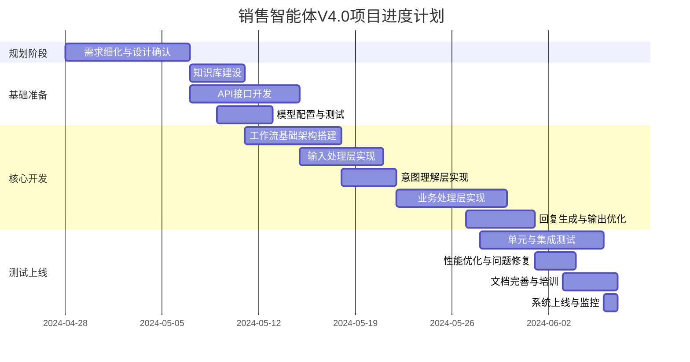

# 销售智能体V4.0项目工时计划

## 工时估算

### 工作总量
- 总需求点：10项核心功能
- 项目周期：4月28日至6月初（约34天，不含周末）
- 人员配置：3人团队

### 各阶段工时分配

| 阶段 | 预计工时(人天) | 日历时间 | 备注 |
|------|--------------|---------|------|
| 需求细化与设计确认 | 6人天 | 4月28日-5月6日 | 3人各2天，包括细化功能需求和确认技术方案 |
| 知识库准备 | 6人天 | 5月7日-5月10日 | 2人并行，包括建立项目资料库和综合知识库 |
| API开发 | 8人天 | 5月7日-5月14日 | 1人专注，包括用户画像、项目推荐和直播信息API |
| 工作流基础架构搭建 | 5人天 | 5月11日-5月17日 | 1人专注，包括创建五层基础架构 |
| 输入处理层开发 | 6人天 | 5月15日-5月20日 | 2人并行，包括图像识别和消息聚合功能 |
| 意图理解层开发 | 4人天 | 5月18日-5月21日 | 1人专注，包括问题分类与意图判断 |
| 业务处理层开发 | 15人天 | 5月22日-5月29日 | 3人并行，包括所有业务分支处理路径 |
| 回复生成与输出优化层 | 9人天 | 5月27日-5月31日 | 3人并行，包括回复生成和格式优化 |
| 测试与调优 | 12人天 | 5月28日-6月5日 | 3人各4天，包括单元测试和集成测试 |
| 文档完善与培训 | 6人天 | 6月3日-6月6日 | 3人各2天，包括操作手册与培训资料 |

### 总工时统计
- 总计：77人天
- 人均：约26人天/人
- 项目工期：约6周（含缓冲时间）

## 进度计划表

## 详细阶段说明

### 4月28日-5月6日：需求细化与设计确认
- 确认10项核心功能的详细规格
- 审核工作流设计方案
- 确定技术栈和模型选择

### 5月7日-5月14日：基础准备
- 知识库建设（项目资料库、综合知识库）
- API接口开发（用户画像、项目推荐、直播信息）
- 模型配置与测试

### 5月15日-5月21日：基础层开发
- 工作流基础架构搭建
- 输入处理层实现（图像识别、消息聚合）
- 意图理解层实现（问题分类系统）

### 5月22日-5月31日：核心功能开发
- 业务处理层实现（各分支路径）
- 回复生成层实现（各类回复生成）
- 输出优化层实现（分段处理、表情增强）

### 6月1日-6月6日：测试与上线
- 单元测试与集成测试
- 性能优化与问题修复
- 文档完善与人员培训
- 系统上线与监控

## 人员分工建议

### 角色分配
- **技术负责人**：负责架构设计、技术选型和关键节点开发
- **AI工程师**：负责模型调优、提示词设计和知识库管理
- **全栈开发**：负责API开发、工作流搭建和前端集成

### 具体分工

| 成员 | 主要负责模块 | 辅助工作 |
|------|------------|---------|
| 技术负责人 | 工作流架构设计 业务处理层 项目监控 | 代码审查 问题排查 技术决策 |
| AI工程师 | 知识库建设 模型调优 回复生成层 | 提示词设计 意图识别 效果评估 |
| 全栈开发 | API接口开发 输入处理层 输出优化层 | 集成测试 前端对接 性能优化 |

### 协作机制
- 每周一、四进行进度同步会议，及时解决开发过程中的问题
- 使用Git进行版本管理，主分支需要经过代码审查后合并
- 建立测试环境与生产环境，确保功能稳定后再上线

## 风险评估与应对

| 风险点 | 可能性 | 影响 | 应对策略 |
|-------|-------|------|---------|
| AI模型响应不稳定 | 中 | 高 | 预设兜底回复，建立模型降级机制 |
| 图像识别准确率不足 | 高 | 中 | 多模型结合，添加人工修正入口 |
| API接口开发延迟 | 中 | 高 | 预留时间缓冲，先使用Mock数据开发 |
| 知识库质量不佳 | 中 | 高 | 增加人工审核环节，优化召回策略 |
| 多人协作冲突 | 低 | 中 | 明确分工界面，定期同步进度 |

## 里程碑计划

1. **需求确认完成**：5月6日
2. **基础架构搭建完成**：5月17日
3. **全部模块开发完成**：5月31日
4. **测试与调优完成**：6月5日
5. **正式上线**：6月6日 