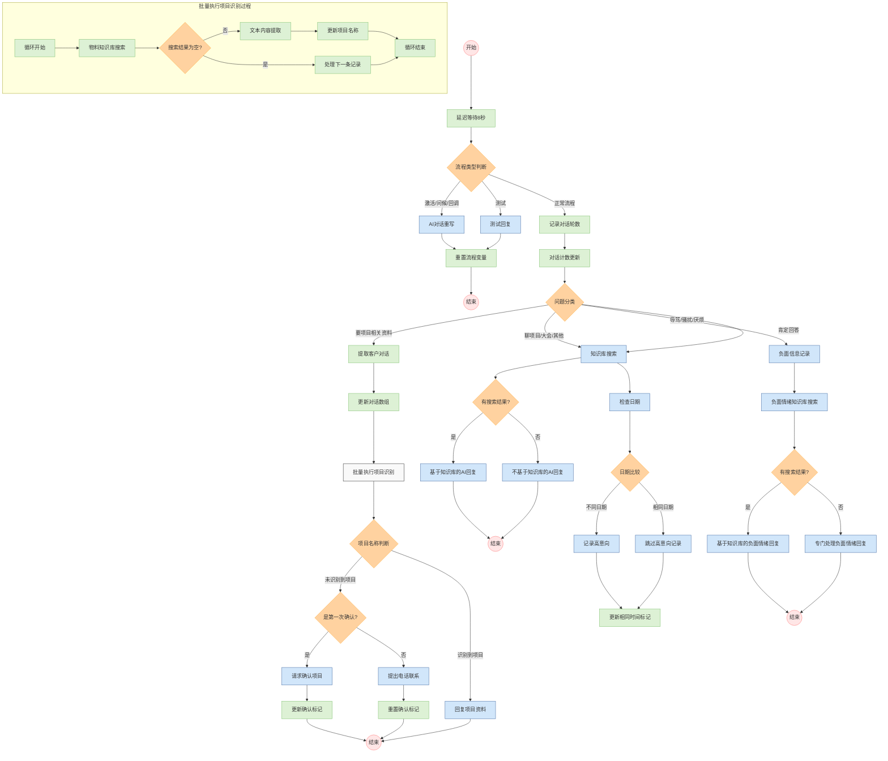

# 销售智能体工作流流程图

## 流程图说明

### 主要流程阶段

1. **初始化阶段**：
   - 工作流启动
   - 延迟等待8秒
   - 判断流程类型（激活/测试/正常）

2. **问题分类阶段**：
   - 记录对话轮数
   - 使用AI模型(gpt-4o-mini)分类问题类型
   - 根据分类结果分流处理

3. **知识库检索阶段**：
   - 针对项目/大会相关问题和肯定回答进行知识库搜索
   - 根据搜索结果决定回复策略

4. **项目资料处理阶段**：
   - 提取客户历史对话
   - 批量分析识别项目名称
   - 根据识别结果提供相应资料

5. **负面情绪处理阶段**：
   - 记录负面情绪信息
   - 专门的回复策略处理负面情绪

6. **高意向客户处理**：
   - 比较当前日期和通知日期
   - 记录高意向客户信息

### 关键决策点

- **流程类型判断**：区分测试模式和实际运行模式
- **问题分类**：将用户问题分为四类不同处理流程
- **知识库搜索结果判断**：根据是否有搜索结果决定回复策略
- **项目名称识别**：判断是否成功识别项目名称
- **确认流程**：当无法识别项目时的二次确认机制

### 特殊处理流程

- **批量执行项目识别**：通过循环处理用户历史对话，提取项目信息
- **负面情绪处理**：专门的处理流程应对客户负面情绪
- **高意向客户处理**：记录和跟踪潜在高价值客户

此流程图全面展示了销售智能体的工作逻辑，包括主流程、各分支处理以及特殊情况的处理机制。 